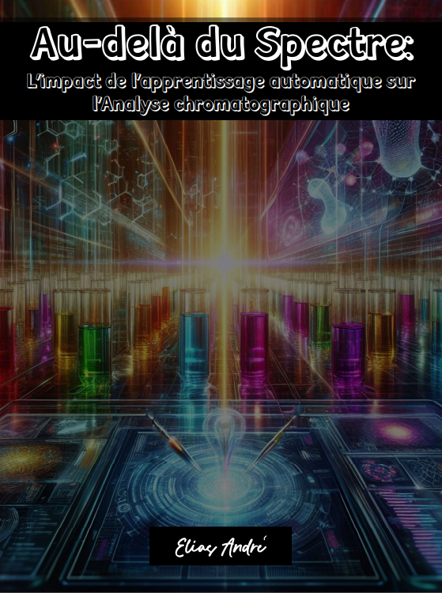

    

-------

# Projeto EBOOK Gerado por I.A.s

 > ℹ️ **NOTE:** Este é o repositório desenvolvido durante o curso de ChatGPT no qual o [Felipe](https://github.com/felipeAguiarCode) foi instrutor técnico na plataforma da [DIO](https://dio.me)

Projeto com o objetivo de gerar um ebook digital com as facilidades das ferramentas de IA. todos os prompts
seguem abaixo.

<a href="https://github.dev/Elias-Andre/prompts-recipe-to-create-a-ebook/blob/6c4cb630d56d7bf77ebbb8c44763b5305281719a/output/Ebook-Au-dela_du_Spectre-Elias%20Andr%C3%A9.pdf" title="View PDF now"> 📕Clique aqui para ler</a>

## 💻 Tecnologias utilizadas no projeto

- [ChatGPT](https://chat.openai.com/) 
- [Copilot](https://copilot.microsoft.com)
- [PowerPoint](https://www.microsoft.com/en/microsoft-365/powerpoint)

## 🧠 Prompts

ChatGPT：

|   Ação   | prompt                                                                                                                                                                                                                                                                         |
| :------: | ------------------------------------------------------------------------------------------------------------------------------------------------------------------------------------------------------------------------------------------------------------------------------ |
|  título  | Create an epic, short and attractive ebook title with this subject, niches: Chemistry, chromatogaphy, machine learning, software development and data analysis and pharmaceutical and health industries                                                       |
| conteúdo | Explaining the application of machine learning in analytical chemistry, particularly in the context of chromatography, would likely attract a lot of attention from non-specialists. Here's why: Relevance,Tangible Examples, Innovation, Practical Implications |

Copilot：

|  Ação  | prompt                                                                                 |
| :----: | -------------------------------------------------------------------------------------- |
| título | Create an ebook image that portrays a futuristic laboratory setting, where beams of light refract through glass columns filled with colorful liquids. At the forefront, a sophisticated computer screen displays intricate data visualizations, symbolizing the integration of machine learning technology. The vibrant colors and dynamic composition evoke a sense of scientific exploration and innovation, while subtle hints of molecular structures in the background hint at the intricate complexities awaiting discovery. This visually compelling image invites viewers to delve into the intersection of technology and chemistry, promising a journey beyond conventional boundaries in analytical science. Fosusing in pharmaceutical industry and elementes of chromatography.|

## ✨ Features

- Conteúdo gerado via ChatGPT
- Imagens geradas via Copilot

## 📚 Materiais

- Imagens utilizadas em `assets`
- ebook gerado em `output`

## 🏆 Bônus
O desafio foi ministrado em português, para poder me desafiar, optar por utilizar apenas a linguagem em Inglês para todos os prompts e para treinar minha escrita em francês, utilizei a linguagem para escrever o ebook.

## 👨‍💻 Sobre mim
Elias André

 

